# Editor Features

smelt's Language Server Protocol (LSP) implementation brings the kind of editor experience you'd expect from a statically-typed language to your data pipeline. Every feature works in real time as you type -- no build step, no waiting.

!!! tip "Setup first"
    If you haven't configured the LSP yet, see [Editor Setup](editor-setup.md) to get started.

## Real-Time Diagnostics

Catch errors the moment you make them, not minutes later when a pipeline run fails.

smelt validates your SQL continuously: undefined model references, undeclared columns, type mismatches, and parse errors all surface as you type. In dbt, a typo in a `ref()` call means a failed build. In smelt, it's a red squiggle before you finish the line.


The diagnostics cover the full range of common errors:

- **Undefined refs** -- referencing a model that doesn't exist
- **Undeclared columns** -- using a column name not present in the upstream schema or source `.yml`
- **Parse errors** -- SQL syntax mistakes
- **Type mismatches** -- operations on incompatible types

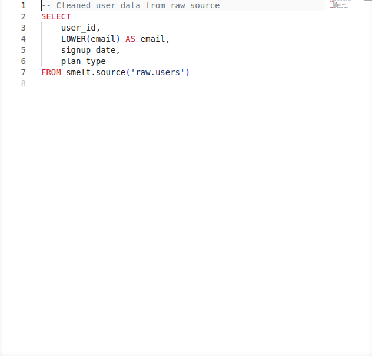

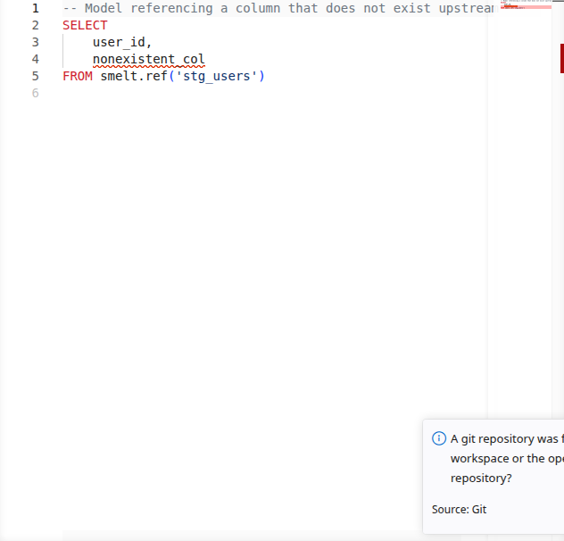

## Go-to-Definition

Trace your data lineage by jumping directly to definitions -- from a `smelt.<name>` call to the upstream model, from a column reference to where it's defined, or from a CTE usage to its definition.

In a large pipeline with dozens of models, you can follow the data flow without ever leaving your editor. No more grepping for model names or manually opening files.

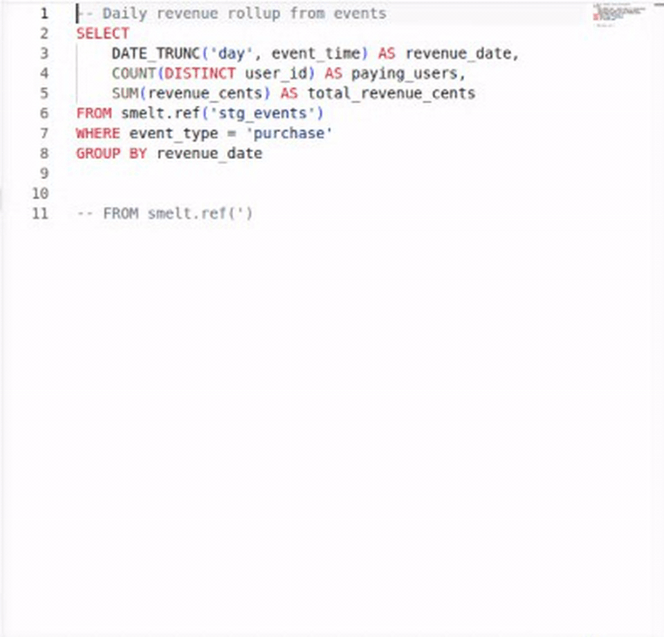

Go-to-definition works for:

| Cursor position | Jumps to |
|---|---|
| `smelt.model_name` | The referenced model's SQL file |
| `smelt.sources.schema.table` | The per-entity source `.yml` file |
| CTE name in FROM/JOIN | The CTE definition in the WITH clause |
| Table alias (e.g., `t` in `t.column`) | Where the alias is defined |
| Column reference | The column's definition in the upstream SELECT or source `.yml` |

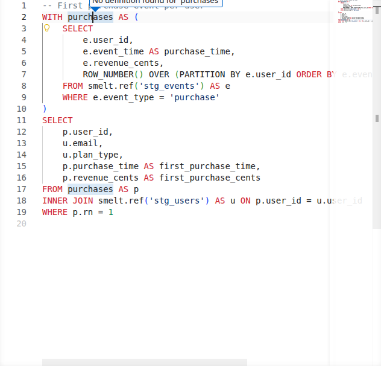

## Hover Information

Hover over any model reference, source, or CTE to see its full schema -- column names, types, and where the data comes from.

Column types include nullability: a non-nullable column shows as `T NOT NULL` (for example `INTEGER NOT NULL`), while a nullable column shows the bare type (for example `INTEGER`). This matches the annotation syntax you write in function signatures, so what you see in hover is always consistent with what you type.

This is particularly useful when writing joins or aggregations: you can quickly check what columns are available without switching files.

Hovering over a `smelt.<path>` reference into a partition-grain incremental model also appends a
one-line scan-window clamp readout below the schema table when the source carries a resolvable
`before`/`after` bound — the same run-relative window `smelt explain --json`'s `source_bounds`
reports.

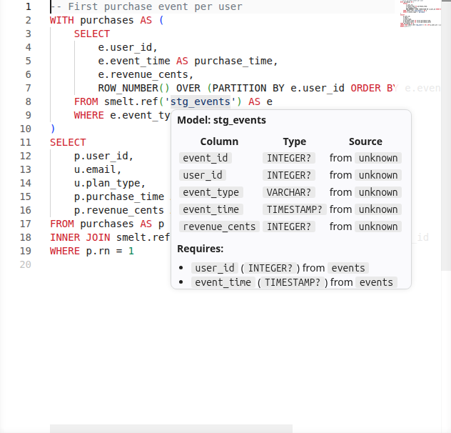

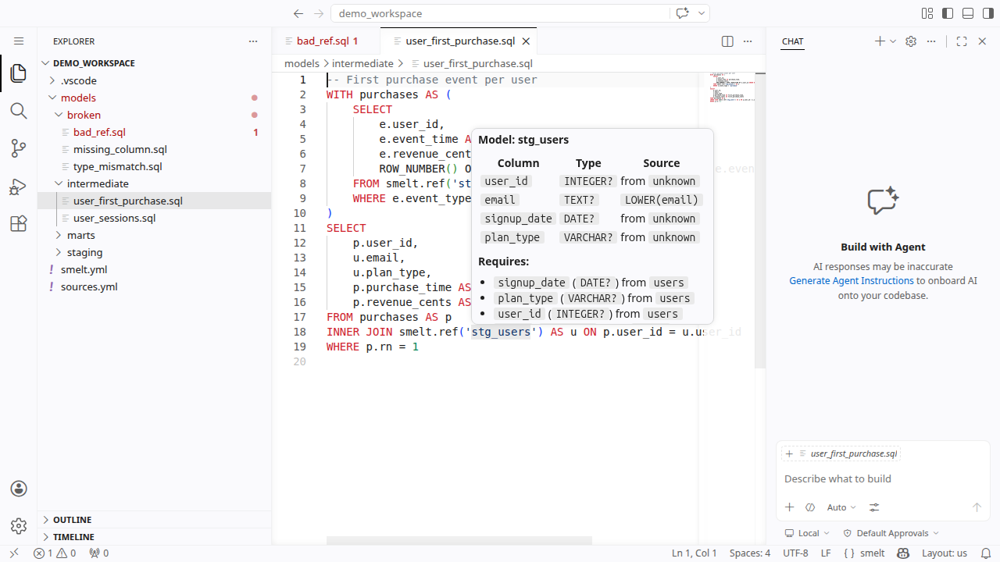

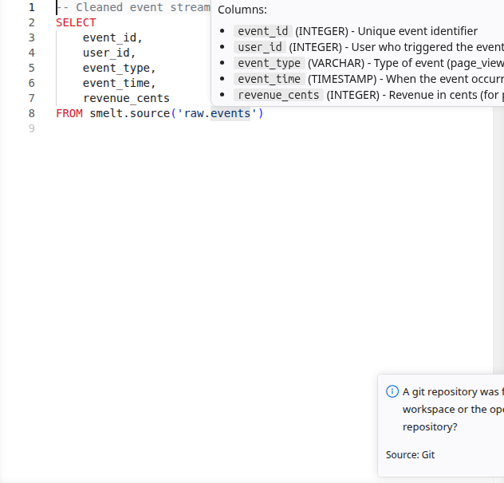

## Code Completion

Build queries faster with context-aware completions. smelt suggests model names inside `smelt.<name>`, source names inside `smelt.sources.<name>`, and column names when you're writing SELECT lists or WHERE clauses.

Completions are schema-aware: they know what columns each upstream model exposes, so you get accurate suggestions as you type.

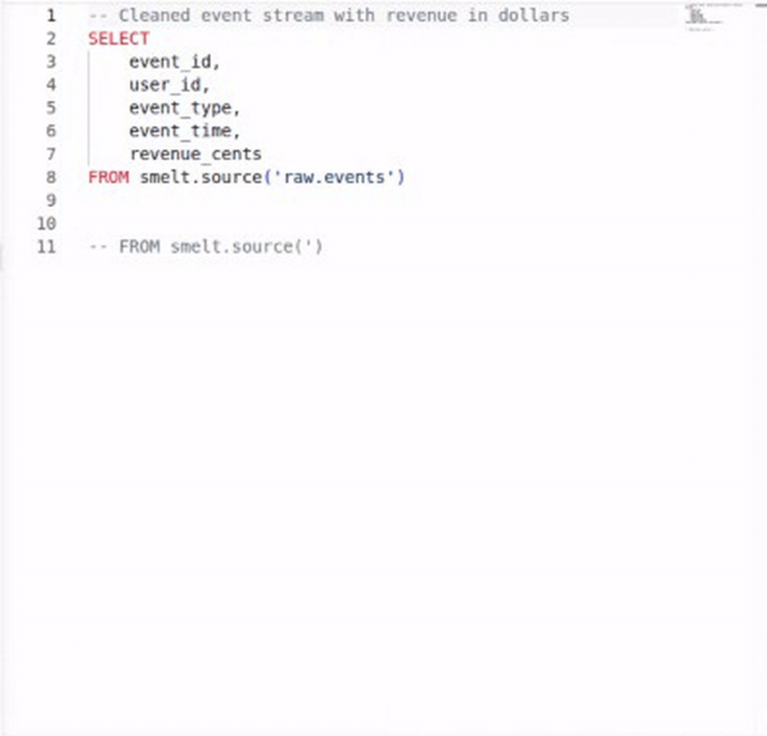

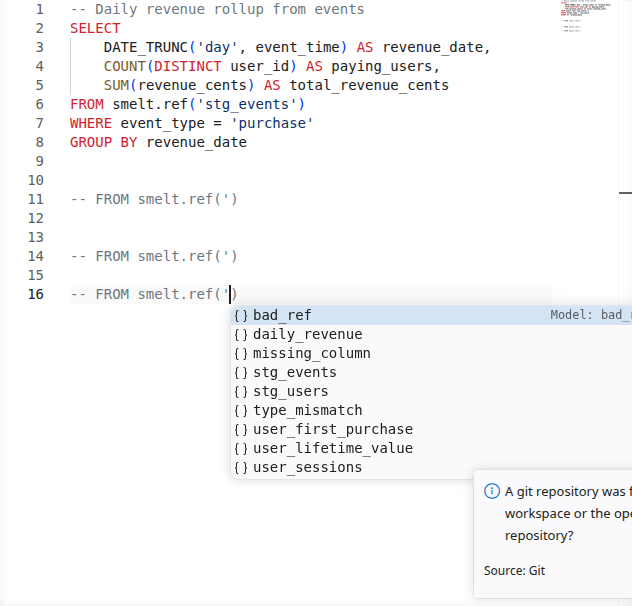

## Find References

Answer "who uses this model?" with a single keystroke. Find References shows every downstream consumer of a model or every usage of a CTE within a file.

In dbt, discovering downstream impact means grepping the codebase for `ref('model_name')`. In smelt, it's built into the editor.

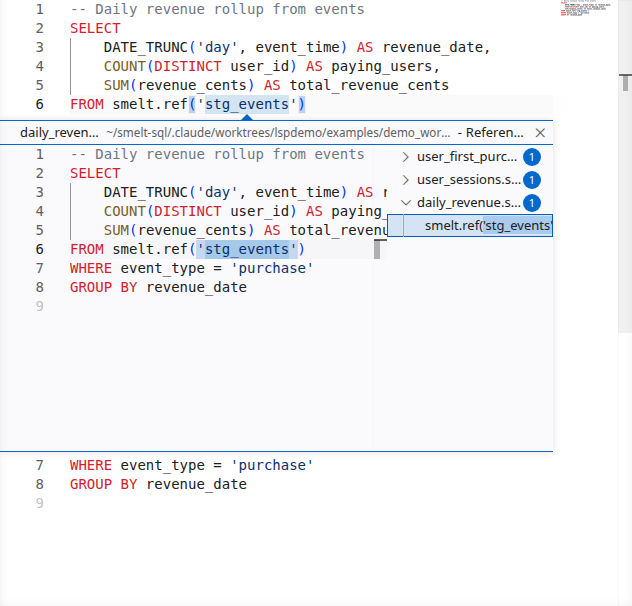

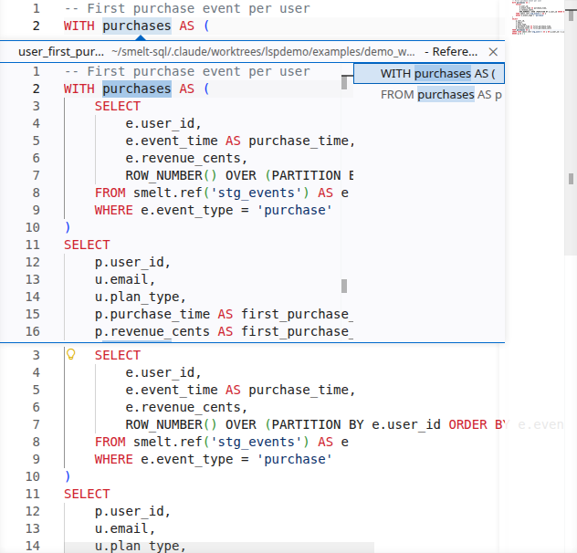

## Rename Refactoring

Rename a model and have every reference across the project update automatically. The LSP shows a preview of all changes before applying them, so you can review the impact.

Rename refactoring works for the following targets:

| Cursor position | What is renamed |
|---|---|
| `smelt.<name>` model reference | All references to that model across the workspace |
| CTE name | The CTE definition and all usages within the same file |
| Column name | The column across local, upstream, and downstream files |
| Lambda parameter | The binder and every reference to it inside the lambda body |

When renaming a lambda parameter (for example the `x` in `fn x => x + 1`), the rename updates the parameter binder and every use of that parameter within the lambda's body. Inner lambdas that shadow the parameter are left untouched. The new name must be a valid identifier, must not collide with a meta-namespace keyword (`if`, `then`, `else`, `fn`, `let`), and must not shadow an outer binder already referenced inside the lambda body.

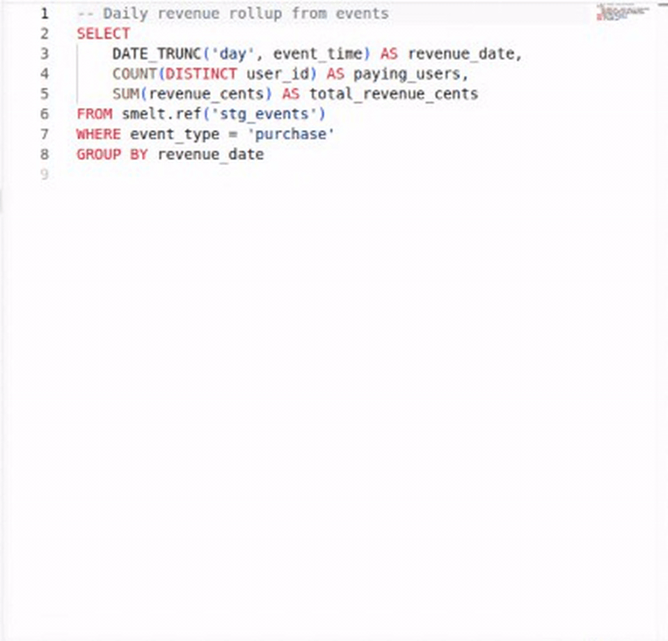

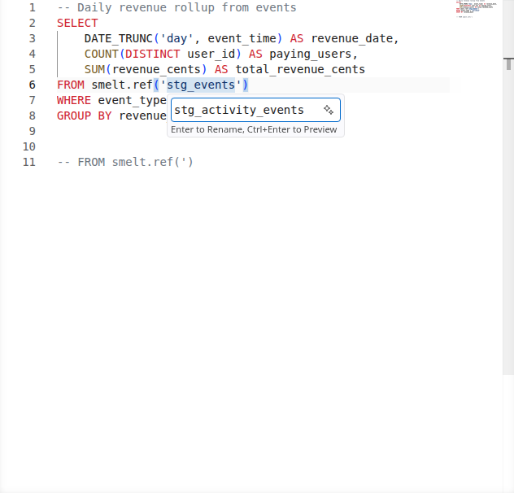

## Code Actions & Quick Fixes

When smelt detects an error, it often suggests a fix. The most useful code action: if you reference a model that doesn't exist yet, smelt offers to create the SQL file for you.

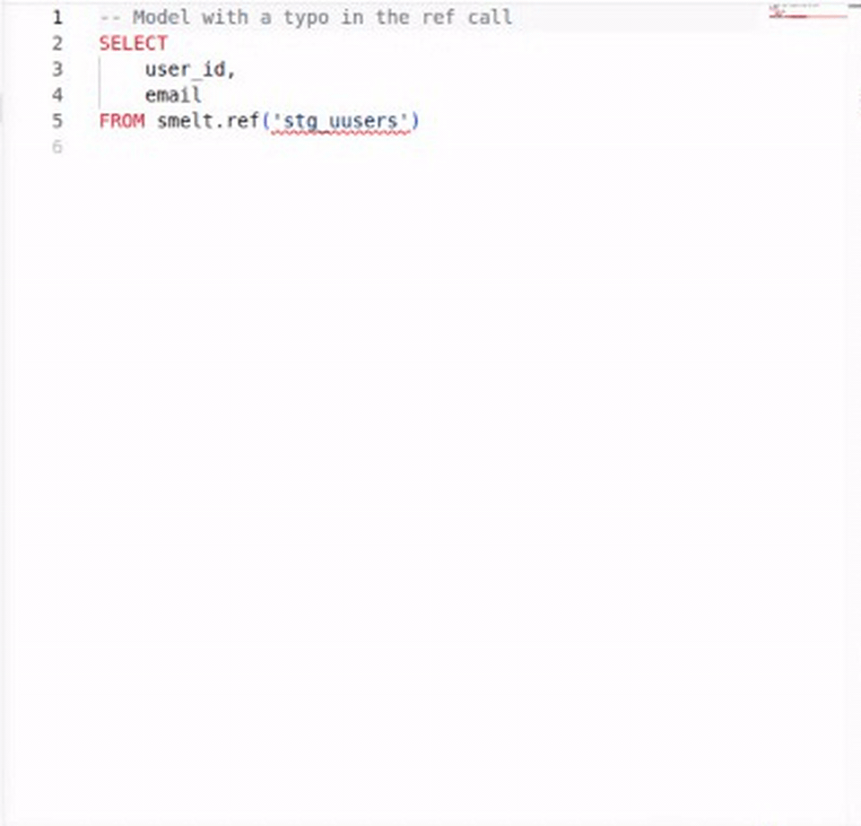

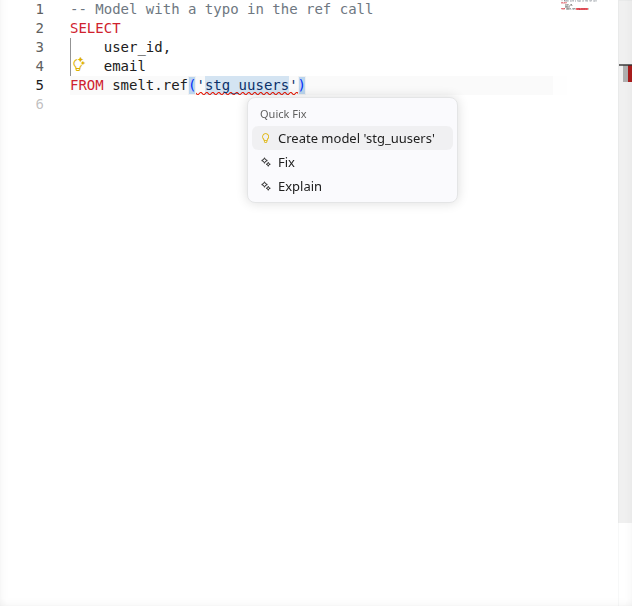

## Property Diff

While you're editing, the LSP compares each model's derived properties (grain, row identity,
maintenance technique, and the rest — see `docs-site/docs/reference/smelt-explain.md`) against a
git baseline, the same comparison `smelt explain --diff` prints from the command line, and folds
the shift into the same short list of reviewer-facing **stories** the CLI prints. A model whose
properties have shifted relative to that baseline gets a code lens on its first line, naming how
many stories are risks and how many are costlier:

```
1 risk, 1 costlier vs main
```

`<short ref>` is the baseline's ref name, or a 7-character commit abbreviation when the baseline
resolved to a bare commit; a model with neither a risk nor a costlier story just reads `changed vs
main`. Every `risk` or `cost` story also gets its own warning diagnostic — one per story, not one
per underlying change it folds — with the story's lead sentence and detail as the message,
anchored as precisely as the story's subject allows: a story about a column anchors on that column
in the `SELECT` list, a story about a source or an upstream model anchors on the `FROM`/`JOIN`
clause that names it, and anything else (a maintenance cell, a refusal, a whole-model story with no
narrower subject) anchors on the model's first line, since it has no narrower home in the file's
text. Hovering over the lens shows the same per-model block `smelt explain --diff`'s text form
prints — the stories first, then the verdicts they fold.

The baseline defaults to the merge-base with `main`, exactly like the CLI. The diff refreshes when
the workspace loads, when a model file is saved or changed on disk outside the editor, and when
the resolved baseline commit changes (for example after `git checkout` or `git pull`) — never on
every keystroke, so an unsaved edit does not *trigger* a refresh by itself. It still counts once
one happens, though: any refresh, from any of those causes, reads a model file's open-buffer
content rather than its on-disk content, so an unsaved edit already visible in the editor shows up
in the next diff even before you save. A `smelt.yml` or source-YAML edit is different — it only
takes effect once saved. While a new diff is being computed, the editor keeps showing whatever it
last computed rather than blanking out; on first load, before any diff has ever been computed, it
shows nothing.

A workspace that is not a git repository, or whose baseline cannot be resolved, shows no lens and
no diagnostic at all — this is not treated as an error, since plenty of projects are worked on
outside of git.
