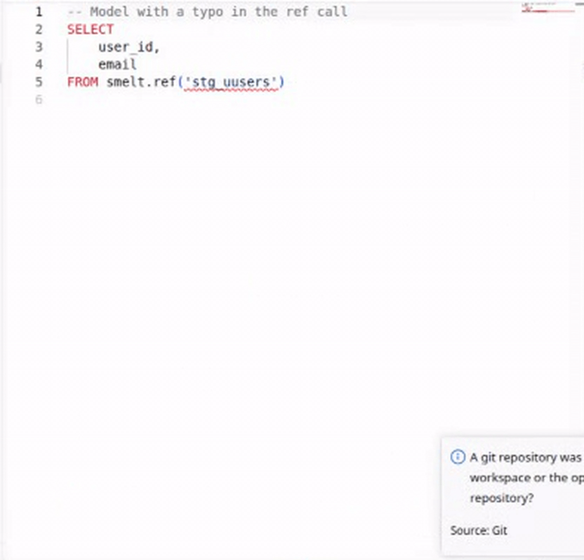

# smelt

Modern data transformation framework.

smelt is a data transformation framework that separates **logical transformation definitions** from **physical execution planning**. Unlike dbt which uses Jinja templates, smelt parses and understands the semantics of your SQL, enabling:

- **Automatic incrementalization** — the framework analyzes what's safe to run incrementally
- **Cross-engine deployment** — split work across DuckDB, Spark, Postgres, etc.
- **Static analysis** — type checking, [rich editor support](guide/editor-features.md), and semantic validation
- **Rule-based optimization** — automatic rewrites with learning from history

## Quick Example

```sql
-- models/daily_revenue.sql
---
name: daily_revenue
materialization: table
incremental:
  enabled: true
  event_time_column: order_date
  partition_column: order_date
tags: [revenue, daily]
---

SELECT
  order_date,
  customer_id,
  SUM(amount) as daily_revenue
FROM smelt.orders
WHERE order_date IS NOT NULL
GROUP BY 1, 2
```

```bash
# Run all models
smelt run

# Run incrementally (only process new data)
smelt run --event-time-start 2025-01-01 --event-time-end 2025-01-02

# Preview what would run
smelt run --dry-run --verbose
```

## Key Differentiators from dbt

| Aspect | dbt | smelt |
|--------|-----|-------|
| Model definition | Jinja templates | Parsed semantic models |
| Incrementalization | Manual `is_incremental()` | Automatic semantic analysis |
| Type checking | None (runtime errors) | Static analysis with LSP |
| Cross-engine | One target per project | Split work across engines |
| Optimization | Manual | Rule-based with learning |

## Editor Experience

smelt's LSP gives you real-time feedback as you write SQL -- diagnostics, go-to-definition, hover schemas, completions, and more. See the full [Editor Features](guide/editor-features.md) showcase.



## Documentation

**New to smelt?** Start with [Installation](getting-started/installation.md) and the [Quickstart](getting-started/quickstart.md) guide.

**Understanding smelt**: Learn [how smelt works](concepts/how-it-works.md) and see how a [project is structured](concepts/project-structure.md).

**Building pipelines**: The [Guide](guide/sql-models.md) covers models, sources, materializations, incremental processing, and more.

**Reference**: Full [CLI command reference](reference/cli.md), [project configuration](reference/smelt-yml.md), and [language specification](reference/language.md).
